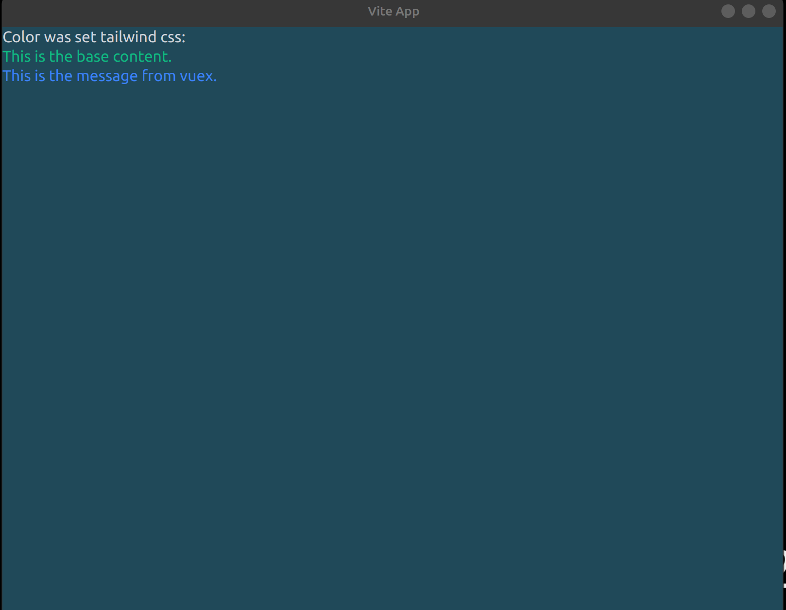

# About this repo

Thanks greatly to the original author which make this repo possible!!!

Check his repo [here](https://github.com/appinteractive/electron-vite-tailwind-starter).

Basically, I just do those things to make [it](https://github.com/appinteractive/electron-vite-tailwind-starter) fit my appitete:

- Run *yarn upgrade* to safely update packages.
- **Remove** typescript configuration as I want the minimal.
- Add **vue-router** and used it.
- Add **vuex** and tested it.
- Make **tailwind css** work again after I make change above.
- Minor adjustments for some assets file.

After everything works I push it on github so I can use this as my starter for my personel projects afterwards.

## Running

Please check the original repo [here](https://github.com/appinteractive/electron-vite-tailwind-starter). Running process is the same.

Run `yarn dev` for electron app.

## Problems I encounter

- Can't upgrade electron version using *yarn add electron@lastest*. Haven't tried npm yet.

**Hope this helps**.
